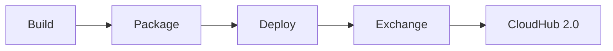

# Mule GitHub Actions

MuleSoft Mule 4 application with automated CI/CD deployment to CloudHub 2.0 using GitHub Actions.

## Overview

This project demonstrates how to set up a complete CI/CD pipeline for deploying Mule applications to Anypoint CloudHub 2.0.

| Component       | Details                  |
| --------------- | ------------------------ |
| **Runtime**     | Mule 4.9.12              |
| **Java**        | JDK 17                   |
| **Target**      | CloudHub 2.0 (US-East-2) |
| **Environment** | Sandbox                  |

## Prerequisites

- Anypoint Platform account
- Connected App with required permissions
- GitHub repository with Actions enabled

## Setup Instructions

### 1. Create a Connected App in Anypoint Platform

1. Go to **Access Management** → **Connected Apps**
2. Click **Create app**
3. Select **App acts on its own behalf (client credentials)**
4. Add the following scopes:
   - `Exchange Contributor` - for publishing to Exchange
   - `Design Center Developer`
   - `CloudHub Organization Admin` or `CloudHub Developer`
   - `Runtime Manager` - Read/Write access to environments
5. Copy the **Client ID** and **Client Secret**

### 2. Configure GitHub Secrets

Go to your repository → **Settings** → **Secrets and variables** → **Actions** → **New repository secret**

Add these secrets:

| Secret Name            | Description                 |
| ---------------------- | --------------------------- |
| `CONNECTED_APP_ID`     | Connected App Client ID     |
| `CONNECTED_APP_SECRET` | Connected App Client Secret |

### 3. Trigger Deployment

The workflow runs automatically on:

- **Push to `main` branch**
- **Manual trigger** via Actions tab → "Deploy to CH2" → "Run workflow"

## Pipeline Stages



| Stage       | Description                                         |
| ----------- | --------------------------------------------------- |
| **Build**   | Runs MUnit tests                                    |
| **Package** | Creates JAR artifact with commit hash               |
| **Deploy**  | Publishes to Exchange, then deploys to CloudHub 2.0 |

## Local Development

### Build

```bash
mvn clean package -DskipMunitTests
```

### Run Tests

```bash
mvn test
```

### Deploy to CloudHub (Manual)

```bash
mvn deploy -DmuleDeploy \
  -Dclient.id=YOUR_CLIENT_ID \
  -Dclient.secret=YOUR_CLIENT_SECRET
```

## Project Structure

```
mule-github-actions/
├── .github/
│   └── workflows/
│       └── deploy.yml          # GitHub Actions workflow
├── src/
│   └── main/
│       ├── mule/
│       │   └── mule-github-actions.xml  # Main Mule flow
│       └── resources/
│           └── log4j2.xml      # Logging config
├── pom.xml                     # Maven configuration
└── README.md
```

## API Endpoint

Once deployed, the application exposes:

| Method | Path | Response                 |
| ------ | ---- | ------------------------ |
| GET    | `/`  | `{"message": "success"}` |

**CloudHub URL**: `https://mule-github-actions.<region>.cloudhub.io/`

## Troubleshooting

### Exchange Authentication Failed

Ensure your Connected App has `Exchange Contributor` scope and the secrets are correctly configured.

### ForwardSslSession Error

This feature requires a Dedicated Load Balancer. Remove `<forwardSslSession>` and `<lastMileSecurity>` from pom.xml for shared spaces.

### Deployment Target Not Found

Verify the target name in pom.xml matches your CloudHub 2.0 region (e.g., `Cloudhub-US-East-2`).

## License

MIT
